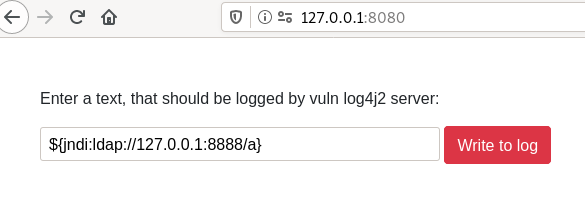

# how to use

```
git clone https://github.com/gramou/vuln-log4j2.git
```

```
cd vuln-log4j2
```

```
sudo docker build . -t vulnlog4j2
```

Start a docker cointainer on port 8080 with localhost binding
```
sudo docker run -it -p 127.0.0.1:8080:8080 vulnlog4j2
```

Open the url http://127.0.0.1:8080



Now press "Write to log" and check the console output. You should see a refused ldap connection.

```
2021-12-14 21:38:02,063 http-nio-8080-exec-6 WARN Error looking up JNDI resource [ldap://127.0.0.1:8888/a]. javax.naming.CommunicationException: 127.0.0.1:8888 [Root exception is java.net.ConnectException: Connection refused (Connection refused)]
	at com.sun.jndi.ldap.Connection.<init>(Connection.java:238)
	at com.sun.jndi.ldap.LdapClient.<init>(LdapClient.java:137)
	at com.sun.jndi.ldap.LdapClient.getInstance(LdapClient.java:1609)
	at com.sun.jndi.ldap.LdapCtx.connect(LdapCtx.java:2749)
	at com.sun.jndi.ldap.LdapCtx.<init>(LdapCtx.java:319)
	at com.sun.jndi.url.ldap.ldapURLContextFactory.getUsingURLIgnoreRootDN(ldapURLContextFactory.java:60)
	at com.sun.jndi.url.ldap.ldapURLContext.getRootURLContext(ldapURLContext.java:61)
	at com.sun.jndi.toolkit.url.GenericURLContext.lookup(GenericURLContext.java:202)
	at com.sun.jndi.url.ldap.ldapURLContext.lookup(ldapURLContext.java:94)
	at javax.naming.InitialContext.lookup(InitialContext.java:417)
	at org.apache.logging.log4j.core.net.JndiManager.lookup(JndiManager.java:172)
	at org.apache.logging.log4j.core.lookup.JndiLookup.lookup(JndiLookup.java:56)
	at org.apache.logging.log4j.core.lookup.Interpolator.lookup(Interpolator.java:221)
	at org.apache.logging.log4j.core.lookup.StrSubstitutor.resolveVariable(StrSubstitutor.java:1110)
	at org.apache.logging.log4j.core.lookup.StrSubstitutor.substitute(StrSubstitutor.java:1033)
	at org.apache.logging.log4j.core.lookup.StrSubstitutor.substitute(StrSubstitutor.java:912)
	at org.apache.logging.log4j.core.lookup.StrSubstitutor.replace(StrSubstitutor.java:467)
	at org.apache.logging.log4j.core.pattern.MessagePatternConverter.format(MessagePatternConverter.java:132)
	at org.apache.logging.log4j.core.pattern.PatternFormatter.format(PatternFormatter.java:38)
	at org.apache.logging.log4j.core.layout.PatternLayout$PatternSerializer.toSerializable(PatternLayout.java:344)
	at org.apache.logging.log4j.core.layout.PatternLayout.toText(PatternLayout.java:244)
	at org.apache.logging.log4j.core.layout.PatternLayout.encode(PatternLayout.java:229)
	at org.apache.logging.log4j.core.layout.PatternLayout.encode(PatternLayout.java:59)
	at org.apache.logging.log4j.core.appender.AbstractOutputStreamAppender.directEncodeEvent(AbstractOutputStreamAppender.java:197)
	at org.apache.logging.log4j.core.appender.AbstractOutputStreamAppender.tryAppend(AbstractOutputStreamAppender.java:190)
	at org.apache.logging.log4j.core.appender.AbstractOutputStreamAppender.append(AbstractOutputStreamAppender.java:181)
	at org.apache.logging.log4j.core.config.AppenderControl.tryCallAppender(AppenderControl.java:156)
	at org.apache.logging.log4j.core.config.AppenderControl.callAppender0(AppenderControl.java:129)
	at org.apache.logging.log4j.core.config.AppenderControl.callAppenderPreventRecursion(AppenderControl.java:120)
	at org.apache.logging.log4j.core.config.AppenderControl.callAppender(AppenderControl.java:84)
	at org.apache.logging.log4j.core.config.LoggerConfig.callAppenders(LoggerConfig.java:540)
	at org.apache.logging.log4j.core.config.LoggerConfig.processLogEvent(LoggerConfig.java:498)
	at org.apache.logging.log4j.core.config.LoggerConfig.log(LoggerConfig.java:481)
	at org.apache.logging.log4j.core.config.LoggerConfig.log(LoggerConfig.java:456)
	at org.apache.logging.log4j.core.config.AwaitCompletionReliabilityStrategy.log(AwaitCompletionReliabilityStrategy.java:82)
	at org.apache.logging.log4j.core.Logger.log(Logger.java:161)
	at org.apache.logging.log4j.spi.AbstractLogger.tryLogMessage(AbstractLogger.java:2205)
	at org.apache.logging.log4j.spi.AbstractLogger.logMessageTrackRecursion(AbstractLogger.java:2159)
	at org.apache.logging.log4j.spi.AbstractLogger.logMessageSafely(AbstractLogger.java:2142)
	at org.apache.logging.log4j.spi.AbstractLogger.logMessage(AbstractLogger.java:2034)
	at org.apache.logging.log4j.spi.AbstractLogger.logIfEnabled(AbstractLogger.java:1899)
	at org.apache.logging.log4j.spi.AbstractLogger.info(AbstractLogger.java:1444)
	at de.gramou.log4j2vulnserver.IndexController.post(IndexController.java:44)
	at sun.reflect.NativeMethodAccessorImpl.invoke0(Native Method)
	at sun.reflect.NativeMethodAccessorImpl.invoke(NativeMethodAccessorImpl.java:62)
	at sun.reflect.DelegatingMethodAccessorImpl.invoke(DelegatingMethodAccessorImpl.java:43)
	at java.lang.reflect.Method.invoke(Method.java:498)
	at org.springframework.web.method.support.InvocableHandlerMethod.doInvoke(InvocableHandlerMethod.java:205)
	at org.springframework.web.method.support.InvocableHandlerMethod.invokeForRequest(InvocableHandlerMethod.java:150)
	at org.springframework.web.servlet.mvc.method.annotation.ServletInvocableHandlerMethod.invokeAndHandle(ServletInvocableHandlerMethod.java:117)
	at org.springframework.web.servlet.mvc.method.annotation.RequestMappingHandlerAdapter.invokeHandlerMethod(RequestMappingHandlerAdapter.java:895)
	at org.springframework.web.servlet.mvc.method.annotation.RequestMappingHandlerAdapter.handleInternal(RequestMappingHandlerAdapter.java:808)
	at org.springframework.web.servlet.mvc.method.AbstractHandlerMethodAdapter.handle(AbstractHandlerMethodAdapter.java:87)
	at org.springframework.web.servlet.DispatcherServlet.doDispatch(DispatcherServlet.java:1067)
	at org.springframework.web.servlet.DispatcherServlet.doService(DispatcherServlet.java:963)
	at org.springframework.web.servlet.FrameworkServlet.processRequest(FrameworkServlet.java:1006)
	at org.springframework.web.servlet.FrameworkServlet.doPost(FrameworkServlet.java:909)
	at javax.servlet.http.HttpServlet.service(HttpServlet.java:681)
	at org.springframework.web.servlet.FrameworkServlet.service(FrameworkServlet.java:883)
	at javax.servlet.http.HttpServlet.service(HttpServlet.java:764)
	at org.apache.catalina.core.ApplicationFilterChain.internalDoFilter(ApplicationFilterChain.java:227)
	at org.apache.catalina.core.ApplicationFilterChain.doFilter(ApplicationFilterChain.java:162)
	at org.apache.tomcat.websocket.server.WsFilter.doFilter(WsFilter.java:53)
	at org.apache.catalina.core.ApplicationFilterChain.internalDoFilter(ApplicationFilterChain.java:189)
	at org.apache.catalina.core.ApplicationFilterChain.doFilter(ApplicationFilterChain.java:162)
	at org.springframework.web.filter.RequestContextFilter.doFilterInternal(RequestContextFilter.java:100)
	at org.springframework.web.filter.OncePerRequestFilter.doFilter(OncePerRequestFilter.java:119)
	at org.apache.catalina.core.ApplicationFilterChain.internalDoFilter(ApplicationFilterChain.java:189)
	at org.apache.catalina.core.ApplicationFilterChain.doFilter(ApplicationFilterChain.java:162)
	at org.springframework.web.filter.FormContentFilter.doFilterInternal(FormContentFilter.java:93)
	at org.springframework.web.filter.OncePerRequestFilter.doFilter(OncePerRequestFilter.java:119)
	at org.apache.catalina.core.ApplicationFilterChain.internalDoFilter(ApplicationFilterChain.java:189)
	at org.apache.catalina.core.ApplicationFilterChain.doFilter(ApplicationFilterChain.java:162)
	at org.springframework.web.filter.CharacterEncodingFilter.doFilterInternal(CharacterEncodingFilter.java:201)
	at org.springframework.web.filter.OncePerRequestFilter.doFilter(OncePerRequestFilter.java:119)
	at org.apache.catalina.core.ApplicationFilterChain.internalDoFilter(ApplicationFilterChain.java:189)
	at org.apache.catalina.core.ApplicationFilterChain.doFilter(ApplicationFilterChain.java:162)
	at org.apache.catalina.core.StandardWrapperValve.invoke(StandardWrapperValve.java:197)
	at org.apache.catalina.core.StandardContextValve.invoke(StandardContextValve.java:97)
	at org.apache.catalina.authenticator.AuthenticatorBase.invoke(AuthenticatorBase.java:540)
	at org.apache.catalina.core.StandardHostValve.invoke(StandardHostValve.java:135)
	at org.apache.catalina.valves.ErrorReportValve.invoke(ErrorReportValve.java:92)
	at org.apache.catalina.core.StandardEngineValve.invoke(StandardEngineValve.java:78)
	at org.apache.catalina.connector.CoyoteAdapter.service(CoyoteAdapter.java:357)
	at org.apache.coyote.http11.Http11Processor.service(Http11Processor.java:382)
	at org.apache.coyote.AbstractProcessorLight.process(AbstractProcessorLight.java:65)
	at org.apache.coyote.AbstractProtocol$ConnectionHandler.process(AbstractProtocol.java:895)
	at org.apache.tomcat.util.net.NioEndpoint$SocketProcessor.doRun(NioEndpoint.java:1722)
	at org.apache.tomcat.util.net.SocketProcessorBase.run(SocketProcessorBase.java:49)
	at org.apache.tomcat.util.threads.ThreadPoolExecutor.runWorker(ThreadPoolExecutor.java:1191)
	at org.apache.tomcat.util.threads.ThreadPoolExecutor$Worker.run(ThreadPoolExecutor.java:659)
	at org.apache.tomcat.util.threads.TaskThread$WrappingRunnable.run(TaskThread.java:61)
	at java.lang.Thread.run(Thread.java:748)
Caused by: java.net.ConnectException: Connection refused (Connection refused)
	at java.net.PlainSocketImpl.socketConnect(Native Method)
	at java.net.AbstractPlainSocketImpl.doConnect(AbstractPlainSocketImpl.java:350)
	at java.net.AbstractPlainSocketImpl.connectToAddress(AbstractPlainSocketImpl.java:206)
	at java.net.AbstractPlainSocketImpl.connect(AbstractPlainSocketImpl.java:188)
	at java.net.SocksSocketImpl.connect(SocksSocketImpl.java:392)
	at java.net.Socket.connect(Socket.java:589)
	at java.net.Socket.connect(Socket.java:538)
	at java.net.Socket.<init>(Socket.java:434)
	at java.net.Socket.<init>(Socket.java:211)
	at com.sun.jndi.ldap.Connection.createSocket(Connection.java:375)
	at com.sun.jndi.ldap.Connection.<init>(Connection.java:215)
	... 92 more
```
